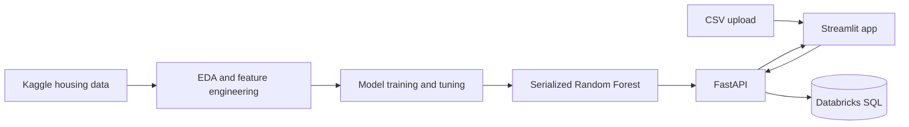

# Iowa Housing ML Pipeline

[](https://www.python.org/)
[](https://fastapi.tiangolo.com/)
[](https://streamlit.io/)

An end-to-end machine learning project that predicts residential sale prices from the Kaggle Iowa housing dataset. The repository covers exploratory data analysis, feature engineering, model training and comparison, a secured prediction API, an interactive web interface, and optional Databricks persistence.

## Live demo

**[Open the Iowa House Price Predictor](https://iowa-housing-ml-pipeline-bbtk683ughoscdljd9txfn.streamlit.app/)**

Upload a CSV of house attributes to generate price predictions. A ready-to-use example is included in [`sample_houses.csv`](sample_houses.csv).

> The deployed application depends on its hosted API. If the service has been idle, the first request may take a little longer while the deployment wakes up.

## Highlights

- Tuned `RandomForestRegressor` trained on 1,460 homes from the Ames, Iowa dataset
- Two engineered features: house age and total above-ground floor area
- 62.5% lower mean absolute error than the median-price baseline
- FastAPI backend with API-key authentication and CSV validation
- Streamlit interface for batch predictions and feature previews
- Optional storage of prediction results in Databricks SQL

## Architecture



The Streamlit app converts raw upload fields into the model's nine-feature contract, sends them to FastAPI, and displays the returned estimates. Users can then choose to persist those predictions to Databricks.

## Model performance

The models were evaluated on a held-out test set of 292 rows using an 80/20 split (`random_state=1`).

| Model | Features | MAE | RMSE | R² |
| --- | ---: | ---: | ---: | ---: |
| Median baseline | — | $56,621 | $85,142 | -0.0164 |
| Random Forest v1 | 7 | $22,394 | $33,526 | 0.8424 |
| Random Forest v2 | 9 | $22,010 | $32,947 | 0.8478 |
| **Tuned Random Forest v2** | **9** | **$21,245** | **$31,748** | **0.8587** |
| Keras neural network | 9 | $31,980 | $41,680 | 0.7564 |

The tuned Random Forest is the deployed model. It reduced MAE by $35,376 compared with the baseline and explains approximately 85.9% of sale-price variance in the test set. See [`results_summary.md`](results_summary.md) for feature correlations and tuning details.

## Features

The final model expects these columns in this exact order:

| Feature | Description |
| --- | --- |
| `LotArea` | Lot size in square feet |
| `YearBuilt` | Original construction year |
| `1stFlrSF` | First-floor area in square feet |
| `2ndFlrSF` | Second-floor area in square feet |
| `FullBath` | Number of full bathrooms |
| `BedroomAbvGr` | Bedrooms above ground |
| `TotRmsAbvGrd` | Total rooms above ground |
| `HouseAge` | `YrSold - YearBuilt` |
| `TotalFlrSF` | `1stFlrSF + 2ndFlrSF` |

The web app accepts the first seven raw features plus `YrSold`, then calculates `HouseAge` and `TotalFlrSF` automatically.

## Run locally

### Prerequisites

- Python 3.11, 3.12, or 3.13
- Git
- Databricks SQL Warehouse credentials only if you want to save predictions

### 1. Clone and install

```bash
git clone https://github.com/Dioniii/iowa-housing-ml-pipeline.git
cd iowa-housing-ml-pipeline
python -m venv .venv
```

Activate the environment:

```bash
# macOS/Linux
source .venv/bin/activate

# Windows PowerShell
.venv\Scripts\Activate.ps1
```

Install the dependencies:

```bash
python -m pip install --upgrade pip
python -m pip install -r requirements.txt
```

### 2. Configure the API

Copy `.env.example` to `.env` and replace the placeholder API key:

```dotenv
API_KEY=replace-with-a-long-random-value
```

To enable saving predictions, also provide the three Databricks connection values and the destination table shown in [`.env.example`](.env.example). The `.env` file is ignored by Git and must never be committed.

Start FastAPI:

```bash
python -m uvicorn main:app --host 127.0.0.1 --port 8001 --reload
```

The health endpoint is available at `http://127.0.0.1:8001/`, and the interactive API documentation is at `http://127.0.0.1:8001/docs`.

### 3. Configure and start Streamlit

Create `.streamlit/secrets.toml`:

```toml
FASTAPI_URL = "http://127.0.0.1:8001"
FASTAPI_API_KEY = "replace-with-the-same-api-key"
```

Then run:

```bash
python -m streamlit run app/streamlit_app.py
```

Open the displayed local URL and upload [`sample_houses.csv`](sample_houses.csv) to try the complete prediction flow.

## API overview

| Method | Endpoint | Authentication | Purpose |
| --- | --- | --- | --- |
| `GET` | `/` | None | Health check and loaded-model summary |
| `POST` | `/predict-csv` | `X-API-Key` | Predict prices from a CSV up to 5 MB |
| `POST` | `/save-predictions` | `X-API-Key` | Save prediction records to Databricks |

For direct API testing, [`sample_houses_9feat.csv`](sample_houses_9feat.csv) already contains the engineered features required by `/predict-csv`.

```bash
curl -X POST "http://127.0.0.1:8001/predict-csv" \
  -H "X-API-Key: replace-with-the-same-api-key" \
  -F "file=@sample_houses_9feat.csv"
```

## Databricks table

Create the configured destination table before using the save endpoint:

```sql
CREATE TABLE IF NOT EXISTS workspace.default.iowa_preditions (
  lot_area DOUBLE,
  year_built DOUBLE,
  first_floor_sf DOUBLE,
  second_floor_sf DOUBLE,
  full_bath INT,
  bedroom_above_gr INT,
  total_rooms_above_grd INT,
  house_age INT,
  total_flr_sf DOUBLE,
  predicted_price DOUBLE
);
```

`iowa_preditions` retains the spelling used by the current application. Set `DATABRICKS_TABLE` if you use a different catalog, schema, or table name.

## Repository structure

```text
.
├── app/
│   └── streamlit_app.py       # Interactive prediction interface
├── data/
│   └── train.csv              # Ames housing training data
├── eda.py                     # Exploratory data analysis
├── main.py                    # FastAPI application
├── model.ipynb                # Analysis, training, and comparison notebook
├── tune_and_dl.py             # Random Forest tuning and neural-network comparison
├── iowa_model.pkl             # Deployed trained model
├── iowa_features.pkl          # Ordered model feature contract
├── sample_houses.csv          # Raw sample input for Streamlit
├── sample_houses_9feat.csv    # Model-ready sample input for FastAPI
├── results_summary.md         # Detailed experiment results
├── pyproject.toml             # Project metadata and backend dependencies
└── requirements.txt           # Full local runtime dependencies
```

## Reproducing the analysis

- Run `eda.py` for the exploratory analysis.
- Open `model.ipynb` to follow feature selection, training, evaluation, and model comparison.
- Run `tune_and_dl.py` to reproduce hyperparameter tuning and the neural-network benchmark. TensorFlow is required only for this experiment and is not part of the application runtime dependencies.

Model artifacts are loaded with `joblib`. Only load `.pkl` files from trusted sources.

## Data source

The project uses the Ames Housing data distributed through Kaggle's [House Prices: Advanced Regression Techniques](https://www.kaggle.com/competitions/house-prices-advanced-regression-techniques) competition.
